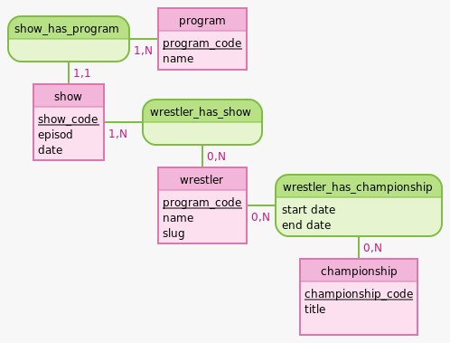

# All Elite Wrestling database

Ce projet me permet de tester et d'apprendre à utiliser l'ORM Sequelize, ainsi que de travailler sur les systemes de base de données.

De plus comme j'ai découvert l'utilisation d'API Rest lors de ma formation, je me concentre surtout la dessus pour tester si le système fonctionne.

Je vais surement passer par React, avec React Router pour la partie Front

## Conception
### User Stories

- En tant qu'utilisateur : 
        -  j'ai besoin de voir qui sont les champions
        -  j'ai besoin de pouvoir voir la liste de tout les catcheurs
        -  je veux avoir le détails d'un catcheur avec sa liste de titres et de combats
        -  je veux voir la liste des shows, et pouvoir trier et filtrer par date, par show
        -  je veux voir pour chaque titre son historique
        -  je veux pour chaque show avoir les détails, de date, de numéro d'épisode, et les combats y ayant eu lieu

- En tant qu'admin, 
        - je veux pouvoir rentrer simplement les infos de chaque show
        - je veux pouvoir automatiser les changements de titres si nécessaire

### Wireframes

-page d'accueil avec menu vers le roster, vers la liste des shows, ainsi qu'une liste des champions
- page roster avec une liste de tout les wrestlers
- page détail wrestler, avec l'historique des titres, des combats
- page show avec une liste de tout les shows, avec possibilité de filtre

### Modèle Conceptuel des Données

*Ce modèle était le modèle de base, lors de la mise en place, je me rends compte qu'il faut d'autres informations*

### Modèle Logique des Données
**championship** (<ins>championship_code</ins>, title, slug ) 
**program** (<ins>program_code</ins>, name) 
**show** (<ins>show_code</ins>, episod, date, _#program_code_) 
**wrestler** (<ins>program_code</ins>, name, slug) 
**wrestler_has_championship** (<ins>_#program_code_</ins>, <ins>_#championship_code_</ins>, start date, end date) 
**wrestler_has_show** (<ins>_#program_code_</ins>, <ins>_#show_code_</ins>)

